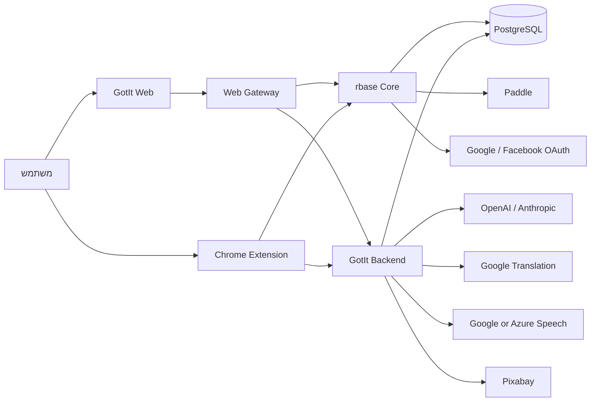
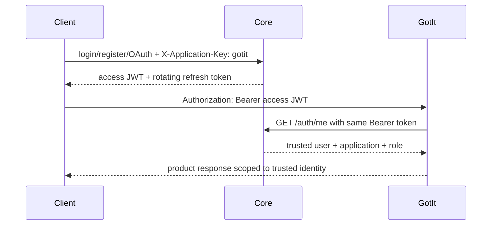
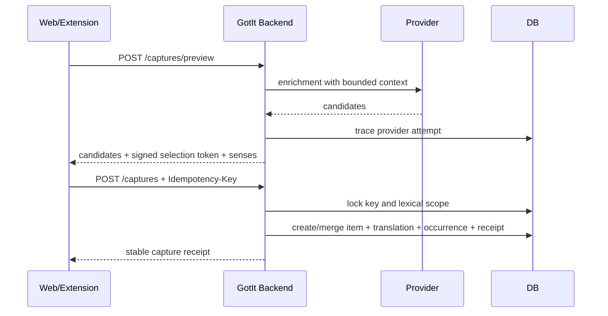

# 02 — ארכיטקטורת המערכת

## 1. הקשר מערכת



## 2. גבולות אחריות

| יכולת | בעלים | אסור להעביר אליו |
|---|---|---|
| Applications, users, auth, sessions | Core | אוצר מילים או attempts |
| Billing, plans, subscriptions, entitlements | Core | כרטיס אשראי ל־GotIt |
| Profile לימודי, captures, library | GotIt Backend | סיסמאות או OAuth tokens |
| Learning engine, practice, XP | GotIt Backend | score סמכותי מהלקוח |
| Web UI ו־BFF proxy | Frontend/Gateway | secrets של providers |
| לכידה בתוך דפי Web | Chrome Extension | תרגום ישיר מספק חיצוני |

## 3. טופולוגיית שירותים

Core ו־GotIt Backend הם modular monoliths נפרדים. כל אחד כולל routes,
services/repositories, config, image ותהליך פריסה משלו. הפרדה זו מאפשרת reuse של
Core למוצרים אחרים בלי לחבר דומיינים או לקוחות.

```text
core-platform                 gotIt-backend
├─ auth                       ├─ profile
├─ applications               ├─ capture/enrichment
├─ users                      ├─ library/word-packs
└─ billing                    ├─ practice/learning
                              ├─ dashboard/gamification
                              ├─ reading/speech
                              └─ private-lessons/transfer
```

## 4. זרימת אימות



ה־`X-Application-Key` הוא מזהה routing ציבורי ולא credential. GotIt אינו מפענח
JWT כאמת מקומית; middleware קורא ל־Core ומייצר `gotitAuth` מהתשובה המהימנה.

## 5. זרימת Capture



## 6. זרימת Practice

1. הלקוח יוצר session עם event ID.
2. השרת בוחר scope/queue ושומר snapshot.
3. הלקוח מבקש exercises; התשובות הנכונות נשארות בשרת.
4. submit attempt כולל UUID יציב ותשובה אחת בלבד.
5. בטרנזקציה: consume exercise, attempt, effects, projections, review, XP, activity,
   algorithm event ו־receipt.
6. retry מחזיר את ה־receipt המקורי גם אם הפריט נערך לאחר מכן.

## 7. תקשורת וסמנטיקת כשל

- Core outage: auth חדש ומוצר מוגן נכשלים סגור ב־`CORE_AUTH_UNAVAILABLE`.
- DB outage: `/ready` מחזיר 503; `/health` נשאר liveness בלבד.
- provider לא מוגדר: capability false או שגיאת unavailable מפורשת; אין fake data.
- network retry: רק GET/preview בטוח או mutation עם idempotency receipt.
- client timeout אינו הוכחה שהמוטציה נכשלה; אותו event ID משמש ל־retry.

## 8. אחסון ובעלות schema

מסד PostgreSQL אחד יכול להכיל שני logical schemas:

- `core`: בבעלות Core runtime/migrator.
- `product_gotit`: בבעלות GotIt runtime/migrator.

טבלאות מוצר משתמשות ב־`application_id` ו־`application_user_id`; foreign keys
ל־Core מבטיחים שיוך תקף. runtime של GotIt ב־Production צריך הרשאות DML רק על
`product_gotit`, ללא DDL וללא קריאה חופשית ב־`core`.

## 9. Frontend Gateway

ה־Web נפרס כ־static SPA מאחורי Node gateway. ה־gateway:

- מגיש assets ו־SPA deep links;
- חושף `/core-api` ו־`/gotit-api` כ־same-origin proxy;
- מאפשר רק רשימת Core routes מוגדרת;
- דוחה origin שונה, path encoding מסוכן ו־redirects;
- מגביל body/rate, מסנן headers ומוסיף CSP/HSTS/security headers;
- מספק `/health`, `/ready`, `/runtime-config` ו־graceful shutdown.

## 10. החלטות ארכיטקטורה

| החלטה | נימוק | השלכה |
|---|---|---|
| service per product | בידוד עסקי ותפעולי | auth call ל־Core בכל בקשה מוגנת |
| PostgreSQL בלי ORM | שליטה ב־constraints וטרנזקציות | SQL ידני ובדיקות integration חובה |
| server-authoritative learning | מונע זיוף progress/XP | exercise receipts ו־server scoring |
| signed provider selections | provenance אמין | secret שרת ו־expiry נדרשים |
| MV3 service worker | מודל Chrome מודרני | state זמני ב־storage ולא בזיכרון בלבד |
| same-origin Web gateway | צמצום CORS וסינון API | gateway הופך רכיב security-critical |
| explicit migrations | rollout נשלט | אין schema mutation בזמן startup של GotIt |

## 11. פער ארכיטקטוני ידוע

`GET /api/v1` של GotIt משתמש בקטלוג סטטי בן 49 נתיבים. בקוד קיימים 56 handlers
מוצריים: שבעה נתיבי private lesson חדשים (`setup`, `roadmaps`, `preferences`,
list/detail/complete/delete) אינם מופיעים בקטלוג. עד תיקון, אין להשתמש בקטלוג
כמקור בלעדי ל־API discovery.

