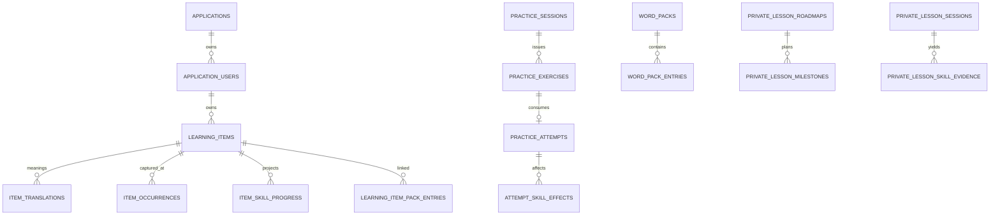

# 08 — מודל נתונים ומיגרציות

## 1. עקרונות

- PostgreSQL עם schemas לוגיים `core` ו־`product_gotit`.
- UUID primary keys; timestamps ב־UTC.
- כל נתון משתמש מוצרי scoped ב־`application_id` + `application_user_id`.
- foreign key מורכב מונע שיוך משתמש לאפליקציה אחרת.
- soft delete לפריטי לימוד; history ו־audit נשמרים.
- attempts/events הם מקור evidence; counters/scores הם projections.
- אין שינוי migration שכבר רץ; שינוי חדש = migration חדש.

## 2. Core — 13 טבלאות

| קבוצה | טבלה | תפקיד |
|---|---|---|
| tenancy | `core.applications` | products/applications |
| identity | `core.application_users` | user per application, status, role |
| auth config | `core.application_auth_providers` | provider config per app |
| auth config | `core.application_auth_provider_clients` | web/extension OAuth clients |
| credentials | `core.password_credentials` | Argon2 password hash |
| credentials | `core.oauth_identities` | Google/Facebook subject link |
| sessions | `core.auth_sessions` | refresh hash, expiry, revocation |
| billing | `core.billing_plans` | catalog, trial, grace, entitlements |
| billing | `core.billing_checkout_attempts` | idempotent checkout |
| billing | `core.billing_subscriptions` | provider subscription projection |
| billing | `core.billing_webhook_events` | webhook idempotency/audit |
| billing | `core.billing_customers` | provider customer mapping |
| billing | `core.billing_transactions` | transaction projection |

## 3. GotIt — 37 טבלאות

### Profile

| טבלה | תפקיד |
|---|---|
| `user_profiles` | defaults, timezone, daily goal, learning preferences |
| `user_language_proficiencies` | self/system/effective CEFR, ranges, confidence |
| `user_interests` | personalization interests |

### Vocabulary ו־Capture

| טבלה | תפקיד |
|---|---|
| `learning_items` | source/sense/status/revision/mastery/review/image |
| `item_translations` | accepted forms, primary/history/provenance |
| `item_occurrences` | capture context + idempotent receipt |
| `item_examples` | examples per semantic revision |
| `enrichment_runs` | provider trace, model, status, latency |
| `tags` | user tag catalog |
| `learning_item_tags` | item↔tag many-to-many |

### Practice ו־Learning

| טבלה | תפקיד |
|---|---|
| `item_skill_progress` | five-skill projections |
| `practice_sessions` | session scope/selection/receipt/summary |
| `practice_exercises` | private answers, expiry, consumption, revision |
| `practice_attempts` | immutable scored attempt + receipt |
| `attempt_skill_effects` | multi-skill effect per attempt |
| `learning_algorithm_events` | versioned transition audit |
| `api_rate_limits` | DB-backed buckets |

### Content, Images ו־Quota

| טבלה | תפקיד |
|---|---|
| `generated_contents` | opened reading + publication receipt |
| `generated_content_items` | reading target bindings/ranges |
| `study_image_assets` | shared binary asset by content hash |
| `ai_monthly_usage` | trial/month quota counters |

### Gamification

| טבלה | תפקיד |
|---|---|
| `user_gamification` | total XP, level, streak projection |
| `xp_events` | unique reward ledger |
| `user_daily_activity` | profile-calendar daily aggregates |

### Word Packs

| טבלה | תפקיד |
|---|---|
| `word_topics` | catalog topic |
| `word_tracks` | language pair + CEFR track |
| `word_packs` | versioned module |
| `word_pack_entries` | curated words/translations/examples |
| `user_word_packs` | installation/removal state |
| `learning_item_pack_entries` | link, exclusion, keep-by-user |

### Private Lessons

| טבלה | תפקיד |
|---|---|
| `private_lesson_sessions` | settings, transcript summary, continuity, report |
| `private_lesson_preferences` | per-language defaults |
| `private_lesson_roadmaps` | active goal plan |
| `private_lesson_milestones` | ordered plan milestones |
| `private_lesson_milestone_evidence` | lesson evidence/task completion |
| `private_lesson_skill_profiles` | skill estimate projection |
| `private_lesson_skill_evidence` | evidence history |

## 4. יחסים מרכזיים

## 5. Learning Item Invariants

- lexical identity: normalized source + source language + translation language + sense.
- כמה senses לאותה כתיבה מותרים.
- primary current translation אחת לכל item.
- accepted current forms עד 100.
- `learning_revision > 0`; semantic edit מגדיל revision.
- exercise/occurrence/example/image קושרים revision רלוונטי.
- `user_status` ו־`learning_status` הם dimensions נפרדים.
- `deleted_at` אינו שקול ל־archived.
- `overall_mastery_score` הוא projection, לא evidence מקורי.

## 6. Idempotency Invariants

- key ייחודי בתוך user/action scope.
- request hash הוא SHA-256 קנוני.
- receipt מכיל version ו־resource IDs.
- replay מאמת שה־receipt עקבי עם השורה.
- key זהה + hash שונה = conflict.
- transaction/advisory lock מונע race לפני unique constraint.

## 7. Migration Ownership

מיגרציות Core ההיסטוריות שיצרו baseline מוצרי נשארות immutable. תוספות חדשות
לדומיין GotIt נמצאות ב־`gotIt-backend/migrations` ומשתמשות בטבלת metadata
`gotit_migrations.pgmigrations` וב־advisory lock משותף. runtime אינו מריץ migration
אוטומטית; migrator נפרד משתמש ב־`GOTIT_MIGRATION_DATABASE_URL`.

Core image הנוכחי מריץ `npm run migrate` לפני start. שינוי זה דורש credential עם
DDL; בהקשחת Production רצוי pre-deploy job נפרד כדי שה־runtime לא יחזיק DDL.

## 8. Backup ו־Restore

- לפני migration production: schema-only backup + backup מנוהל של הספק.
- preflight ו־normalization audit הם read-only.
- down migration רק על DB חד־פעמי; אינו rollback production אוטומטי.
- rollback אפליקטיבי חייב לתמוך ב־schema החדש או להתבצע אחרי restore מתוכנן.
- RPO/RTO ותרגיל restore רבעוני הם החלטה תפעולית פתוחה.

