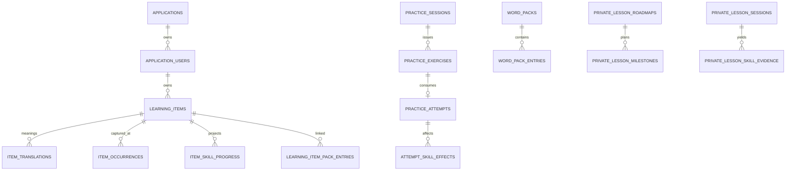

# 08 — מודל נתונים ומיגרציות

## 2026-10-05 - UX 2.1 DEV checkpoint

No migration/table/column changed. Selected program/home language are scoped local presentation keys; preparation draft is validated sessionStorage with a 30-minute TTL and user/application/language/course context. Library return query contains bounded filter/page/selection context. None is authoritative learning evidence or a durable voice session. [Canonical coverage, local verification and deployment blocker](28_UX_2_1_DEV.md).

## 2026-10-05 - Email verification and recovery

Core migration `1790000010000_email-auth-challenges` adds `core.email_auth_challenges` and `core.auth_request_limits`; existing identity/product schemas are unchanged. [Keys, fields, retention and migration evidence](27_EMAIL_AUTH_RECOVERY.md#data-and-security).

## 2026-10-01 — English progress archive production readback

Migration `1790800011000` for Backend `10602736bdf5422116eb838e57e9d708318156be` is applied in production once. The new archive contains 1,418 `known` and 51 `link` rows from the previous catalog. The active version-4 catalog has 3,000 globally distinct English entries and retains 710 exact-sense known rows and 51 same-pack learning links. A read-only join found no active known row without a matching archived source and meaning. The archive remains available for reviewed recovery; no automatic destructive production rollback was used.

## 2026-10-01 — English catalog progress archive (source verified)

`gotIt-backend@10602736bdf5422116eb838e57e9d708318156be` adds one product table, `english_catalog_progress_archive`, through migration `1790800011000`. Its composite key is `(kind, application_id, application_user_id, pack_id, entry_id)`. `kind` is `known` or `link`; each row retains the old English source, Hebrew meaning, original scoped association JSON and archive time. The table preserves unmatched user declarations and pack links during the 60-pack, 3,000-entry version-4 catalog replacement. Matching English **and** meaning restores known marks; links also require the original installed pack. Historical `learning_items`, evidence and practice rows remain. There are 50 product tables after this migration in the disposable PostgreSQL fixture. This is local/integration evidence; production application remains unverified at this checkpoint.

## 2026-10-01 — Forward contextual correction

`gotIt-backend@10bf19712bc9831a77dd9672c5f78701577a2966` adds migration `1790800010000_english-communication-senses.js` and a 213-row correction asset. It checks the previous English source and Hebrew translation for each stable entry ID, updates only catalog translation/normalized translation, and raises affected pack versions from 2 to 3. It changes no table or learner-owned row. Known-entry propagation now joins catalog entries by normalized source and translation, limiting cross-unit state to the same sense. Local disposable PostgreSQL up/down and API regression passed; production migration pending at this checkpoint.

## 2026-10-01 — Known-entry FK follows the product profile

`gotIt-backend@8db500a5594fbc99c1d3e104701b31bd37c372b0` corrects migration `1790800008000` before it has applied in production: `user_word_pack_known_entries` references the existing GotIt `user_profiles(application_id, application_user_id)` scoped key with cascade rather than directly referencing Core. GotIt profiles themselves retain their validated Core user FK. This keeps the dedicated product migrator out of the Core schema. First known-word mutation inserts standard profile defaults with `ON CONFLICT DO NOTHING`; the PostgreSQL suite verifies that first-use path. Production retry pending. See [23_ENGLISH_LEARNING_PATH](23_ENGLISH_LEARNING_PATH.md).

## 2026-10-01 — Known entry state and named-unit replacement

`gotIt-backend@14012a0c6683dde3659bf9e239a7c016adef9a0b` adds `product_gotit.user_word_pack_known_entries` with primary key `(application_id, application_user_id, pack_id, entry_id)`, compound GotIt profile FK, `(pack_id, entry_id)` catalog FK with cascade, `known_at`, and a scoped lookup index. One known row represents a learner-declared word, not learning evidence. English path repeated source forms are propagated to matching pack entries in the same topic. Migration `1790800009000` changes 3,000 catalog rows and 60 pack titles/versions in place; it refuses changes when path installations, links or known rows exist. The reverse migration has the same guard. The prior migrations are immutable. Local PostgreSQL up/down and isolation tests passed; production migration pending. See [23_ENGLISH_LEARNING_PATH](23_ENGLISH_LEARNING_PATH.md).

## 2026-10-01 — Versioned English catalog correction

`gotIt-backend@74eb91d5691b357cbbe60e8262135977a5d2921f` adds forward migration `1790800007000_english-learning-path.js` after the immutable initial seed. It updates one `word_topics` slug/title/description and 72 `word_pack_entries` translations using expected previous values; it adds no table or column and leaves user-owned `learning_items`, translations, and evidence untouched. The down path refuses rollback if any of the 60 packs has user installation/progress. Disposable PostgreSQL migration verification passed; production migration has not been verified. See [23_ENGLISH_LEARNING_PATH](23_ENGLISH_LEARNING_PATH.md).

## 2026-10-01 — English catalog data migration

`gotIt-backend@ba9ab573749d7a2705f44738c40b45d4d30c777a` adds migration `1790800006000_daily-english-catalog.js`: one `word_topics` row, three `word_tracks` rows, 60 `word_packs`, and 3,000 `word_pack_entries` for source `en` and translation `he`. No new table or column is introduced. The migration must run with the dedicated migrator; source presence is not evidence it ran in production. See [23_ENGLISH_LEARNING_PATH](23_ENGLISH_LEARNING_PATH.md).

## 2026-10-01 — Existing phonetic columns

`gotIt-backend@c138f5464de818552a54ca584c43ccdaee980da0` reuses
`product_gotit.learning_items.phonetic_text` and `phonetic_scheme` for the
initial English-to-Hebrew reading guides. The scheme `transliteration:he`
distinguishes them from existing `hebrew_niqqud` data. No migration occurred.
An owner-scoped data update populated 84 active English items in the requested
account; deleted items and non-English source items were excluded. A source
expression or source-language edit still clears both phonetic columns.

## תיקון רצף השיעור — 2026-09-30

תיקון הובלת השיעור אינו משנה טבלאות או ספי התקדמות. מצב דיבור/השמעה ותקציב
פניות נשמרים בזיכרון הלקוח בלבד ונמחקים ביציאה. ההקשר המאושר הקיים נשמר: [22, סעיף 9](22_PERSONAL_COURSES_IMPLEMENTATION.md).

## עדכון מקומי 2026-09-30 — 39 טבלאות מוצר

מיגרציה additive `1789488019000_personal-courses.js` מוסיפה `learning_documents`,
`learning_commands` ו־`private_lesson_sessions.course_context`. המסמכים והקבלות
מבודדים ב־application/user עם FK מורכבים, revision ו־snapshot תוצאה.
הספירה הקודמת של 37 להלן היא baseline; מלאי המוצר לאחר המיגרציה הוא 39, ללא שינוי ב־Core.
[מבנה, פרטיות וקשר ליומן שיעורים ב־22](22_PERSONAL_COURSES_IMPLEMENTATION.md).

## 1. עקרונות

- PostgreSQL עם schemas לוגיים `core` ו־`product_gotit`.
- UUID primary keys; timestamps ב־UTC.
- כל נתון משתמש מוצרי scoped ב־`application_id` + `application_user_id`.
- foreign key מורכב מונע שיוך משתמש לאפליקציה אחרת.
- soft delete לפריטי לימוד; history ו־audit נשמרים.
- attempts/events הם מקור evidence; counters/scores הם projections.
- אין שינוי migration שכבר רץ; שינוי חדש = migration חדש.

## 2. Core — 13 טבלאות

| קבוצה | טבלה | תפקיד |
|---|---|---|
| tenancy | `core.applications` | products/applications |
| identity | `core.application_users` | user per application, status, role |
| auth config | `core.application_auth_providers` | provider config per app |
| auth config | `core.application_auth_provider_clients` | web/extension OAuth clients |
| credentials | `core.password_credentials` | Argon2 password hash |
| credentials | `core.oauth_identities` | Google/Facebook subject link |
| sessions | `core.auth_sessions` | refresh hash, expiry, revocation |
| billing | `core.billing_plans` | catalog, trial, grace, entitlements |
| billing | `core.billing_checkout_attempts` | idempotent checkout |
| billing | `core.billing_subscriptions` | provider subscription projection |
| billing | `core.billing_webhook_events` | webhook idempotency/audit |
| billing | `core.billing_customers` | provider customer mapping |
| billing | `core.billing_transactions` | transaction projection |

## 3. GotIt — 37 טבלאות

### Profile

| טבלה | תפקיד |
|---|---|
| `user_profiles` | defaults, timezone, daily goal, learning preferences |
| `user_language_proficiencies` | self/system/effective CEFR, ranges, confidence |
| `user_interests` | personalization interests |

### Vocabulary ו־Capture

| טבלה | תפקיד |
|---|---|
| `learning_items` | source/sense/status/revision/mastery/review/image |
| `item_translations` | accepted forms, primary/history/provenance |
| `item_occurrences` | capture context + idempotent receipt |
| `item_examples` | examples per semantic revision |
| `enrichment_runs` | provider trace, model, status, latency |
| `tags` | user tag catalog |
| `learning_item_tags` | item↔tag many-to-many |

### Practice ו־Learning

| טבלה | תפקיד |
|---|---|
| `item_skill_progress` | five-skill projections |
| `practice_sessions` | session scope/selection/receipt/summary |
| `practice_exercises` | private answers, expiry, consumption, revision |
| `practice_attempts` | immutable scored attempt + receipt |
| `attempt_skill_effects` | multi-skill effect per attempt |
| `learning_algorithm_events` | versioned transition audit |
| `api_rate_limits` | DB-backed buckets |

### Content, Images ו־Quota

| טבלה | תפקיד |
|---|---|
| `generated_contents` | opened reading + publication receipt |
| `generated_content_items` | reading target bindings/ranges |
| `study_image_assets` | shared binary asset by content hash |
| `ai_monthly_usage` | trial/month quota counters |

### Gamification

| טבלה | תפקיד |
|---|---|
| `user_gamification` | total XP, level, streak projection |
| `xp_events` | unique reward ledger |
| `user_daily_activity` | profile-calendar daily aggregates |

### Word Packs

| טבלה | תפקיד |
|---|---|
| `word_topics` | catalog topic |
| `word_tracks` | language pair + CEFR track |
| `word_packs` | versioned module |
| `word_pack_entries` | curated words/translations/examples |
| `user_word_packs` | installation/removal state |
| `learning_item_pack_entries` | link, exclusion, keep-by-user |
| `user_word_pack_known_entries` | application-scoped learner-declared known catalog entries |

### Private Lessons

| טבלה | תפקיד |
|---|---|
| `private_lesson_sessions` | settings, transcript summary, continuity, report |
| `private_lesson_preferences` | per-language defaults |
| `private_lesson_roadmaps` | active goal plan |
| `private_lesson_milestones` | ordered plan milestones |
| `private_lesson_milestone_evidence` | lesson evidence/task completion |
| `private_lesson_skill_profiles` | skill estimate projection |
| `private_lesson_skill_evidence` | evidence history |

## 4. יחסים מרכזיים

## 5. Learning Item Invariants

- lexical identity: normalized source + source language + translation language + sense.
- כמה senses לאותה כתיבה מותרים.
- primary current translation אחת לכל item.
- accepted current forms עד 100.
- `learning_revision > 0`; semantic edit מגדיל revision.
- exercise/occurrence/example/image קושרים revision רלוונטי.
- `user_status` ו־`learning_status` הם dimensions נפרדים.
- `deleted_at` אינו שקול ל־archived.
- `overall_mastery_score` הוא projection, לא evidence מקורי.

## 6. Idempotency Invariants

- key ייחודי בתוך user/action scope.
- request hash הוא SHA-256 קנוני.
- receipt מכיל version ו־resource IDs.
- replay מאמת שה־receipt עקבי עם השורה.
- key זהה + hash שונה = conflict.
- transaction/advisory lock מונע race לפני unique constraint.

## 7. Migration Ownership

מיגרציות Core ההיסטוריות שיצרו baseline מוצרי נשארות immutable. תוספות חדשות
לדומיין GotIt נמצאות ב־`gotIt-backend/migrations` ומשתמשות בטבלת metadata
`gotit_migrations.pgmigrations` וב־advisory lock משותף. runtime אינו מריץ migration
אוטומטית; migrator נפרד משתמש ב־`GOTIT_MIGRATION_DATABASE_URL`.

Core image הנוכחי מריץ `npm run migrate` לפני start. שינוי זה דורש credential עם
DDL; בהקשחת Production רצוי pre-deploy job נפרד כדי שה־runtime לא יחזיק DDL.

## 8. Backup ו־Restore

- לפני migration production: schema-only backup + backup מנוהל של הספק.
- preflight ו־normalization audit הם read-only.
- down migration רק על DB חד־פעמי; אינו rollback production אוטומטי.
- rollback אפליקטיבי חייב לתמוך ב־schema החדש או להתבצע אחרי restore מתוכנן.
- RPO/RTO ותרגיל restore רבעוני הם החלטה תפעולית פתוחה.
# Guided lesson data — 2026-10-06

Migration `1791280000000_guided-lesson-activities.js` adds nullable `private_lesson_sessions.word_pack_context` and the composite owner/lesson tables `private_lesson_activities` and `private_lesson_activity_commands`. Revision/fingerprint constraints and scoped FKs preserve isolation; successful report completion purges temporary snapshots/receipts atomically. No audio archive or second billing model is introduced. [Constraints, lifecycle, role separation and rollback](30_FIGMA_FULL_DEV.md#data-model-and-privacy). DEV migration pending at this checkpoint.

## 2026-10-06 — DEV learning-path correction

No schema change; journey is derived from owned pack links, known declarations and existing learning status. See [canonical contract and exact source](31_LEARNING_PATH_FIDELITY_DEV.md).

## 2026-10-06 — Practice clarity / native reading guides

[Canonical requested behavior, Backend source, API/provider/data bounds and exact verification state](32_PRACTICE_CLARITY.md). Backend implemented and locally verified (239 unit / 32 PostgreSQL tests); Web/release work remains pending. No new deployment verified.

