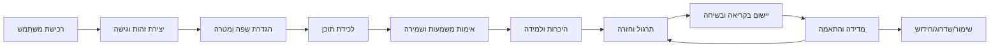

# 15 — אפיון תעשייה וניהול: מודל הפעלה, תהליכים ובקרות

## 2026-10-01 — English path prior-knowledge control

In the PACK-01 / UC-04A flow, the learner may declare one previewed word or a full unit already known before installation. Control points: validate that all IDs belong to the accessible pack, write application-scoped known state once, carry repeated source forms across this path, exclude known entries from pack practice, and count declared knowledge separately from evidence-backed mastery. This reduces repeated teaching while preserving learning evidence and XP integrity. Monitor the share of units skipped and reversals separately from actual mastery; no target KPI threshold is asserted. Backend `gotIt-backend@14012a0c6683dde3659bf9e239a7c016adef9a0b` passed disposable PostgreSQL regression; Web/deployment pending.


## תיקון רצף השיעור — 2026-09-30

בקרת איכות שיעור נוספה לפי כשל שדווח: שפה תואמת, הסבר לפני הפקה, קידום
לאחר הצלחה, ויוזמת מורה אחרי שתיקה עם תקציב פניות. אלה בקרות ממומשות;
שיפור KPI או שביעות רצון טרם נמדד. פירוט: [22, סעיף 9](22_PERSONAL_COURSES_IMPLEMENTATION.md).

## הרחבת P12–P13 — קורס אישי, 2026-09-30

P12 מתחיל בשיחת צורכי למידה ושני שערי אישור: snapshot העדפות, ואז גרסת תוכנית.
P13 מקשר שיעור ליעד מוגדר, מציג דוח קצר ויוצר חבילת בית מתוך עדות למידה.
התרגול מחזיר ראיות והמשך מומלץ; אי־ביצוע אינו חוסם שיעור. בקרות: בעלות, CAS,
deduplication, מקור משימה, הפרדה בין כיסוי לעצמאות ולשימור. סיכון מרכזי: איכות
תוכן/שיפוט ספק ורמת נגישות לילדים, הטעונים QA. מדדי הזרימה המוצעים באפיון 21 טרם
קיבלו baseline או יעד מספרי. [תהליך ממומש וגבולות 22](22_PERSONAL_COURSES_IMPLEMENTATION.md).

## 1. אמנת הפרויקט

### 1.1 בעיה עסקית

לומדי שפה פוגשים מילים בהקשר אמיתי, אך המעבר מלכידה אקראית לזכירה ארוכת
טווח שבור בין כלים: תרגום נמצא במקום אחד, רשימה במקום אחר, והתרגול אינו מתחשב
במשמעות, בהקשר או בראיות למידה. GotIt מרכז את השרשרת ומודד אותה מקצה לקצה.

### 1.2 יעד

להגדיל את מספר פריטי אוצר המילים שהמשתמש לומד ושומר לטווח ארוך, תוך הקטנת
החיכוך בלכידה, שמירה על אמינות ההתקדמות ומתן שליטה למשתמש.

### 1.3 תוצרי המערכת

1. פריט לימוד מאומת בהקשר ובמשמעות.
2. תור למידה מותאם אישית.
3. evidence היסטורי לפי מיומנות.
4. סטטוס learned/established מבוסס כללים.
5. תוכן קריאה ושיחה שמשתמש בפריטים שנלמדו.
6. דוח התקדמות אישי ותוכנית המשך.
7. גישה מסחרית מבוקרת באמצעות trial/subscription.

### 1.4 גבולות היקף

בתוך ההיקף:

- Core identity, roles, billing ו־entitlements.
- GotIt Web, Backend ו־Chrome Extension.
- vocabulary capture/library, packs, practice, reading, speech, private lesson.
- PostgreSQL schemas, providers, deployment, privacy ו־quality gates.

מחוץ להיקף הנוכחי:

- מוצרי rbase אחרים.
- מערכת LMS ארגונית, כיתות ומורים מנהלים.
- רשת חברתית או שיתוף מילים בין משתמשים.
- אפליקציות native ל־iOS/Android.
- הבטחה מחקרית שרמת CEFR או mastery שוות להסמכה רשמית.

## 2. בעלי עניין וצרכים

| בעל עניין | צורך | מדד הצלחה | סיכון מרכזי |
|---|---|---|---|
| לומד | שמירה מהירה ולמידה אמינה | learned items, retention | חיכוך או progress לא אמין |
| Product Owner | שימוש, התמדה והכנסה | WAU, conversion, churn | feature breadth ללא focus |
| Learning Expert | validity פדגוגי | recall retention | כלל mastery שגוי |
| Engineering | חוזים יציבים ותחזוקה | defect/lead time | drift בין 4 repos |
| Operations | זמינות והתאוששות | SLO, MTTR, restore | provider/DB outage |
| Security/Privacy | מזעור נתונים ובקרות | incidents, deletion SLA | token/content exposure |
| Finance | עלות ספקים ורווחיות | cost per active/paid user | AI/Realtime cost |
| Support | אבחון משתמשים | first-response resolution | אין admin/audit tooling |
| Google/Meta/Paddle/AI providers | שימוש תקין בחוזים | policy compliance | שינוי API/חסימה |
| Chrome Web Store | privacy ו־permission justification | approval | permissions רחבים |

## 3. דרישות CTQ — Critical to Quality

| CTQ | הגדרה תפעולית | יעד מוצע | נקודת מדידה |
|---|---|---|---|
| Capture correctness | משמעות ושפות שאושרו נשמרות ללא כפילות | 99.9% mutation integrity | receipt/DB audit |
| Capture speed | זמן מ־selection עד preview | P95 ≤ 3s ללא cold/provider | client + server telemetry |
| Learning integrity | אין XP/mastery ללא evidence תקף | 100% server-authoritative | attempt transaction |
| Review relevance | פריטים due/חלשים מופיעים בזמן | ≥95% queue contract | offline queue evaluation |
| Availability | יכולת ליבה זמינה | 99.9% חודשי מוצע | ready + synthetic |
| Data isolation | אין cross-user/application access | 0 incidents | integration/security tests |
| Idempotency | retry אינו יוצר כפילות | 100% covered mutations | replay/conflict metrics |
| Accessibility | keyboard/RTL/mobile תפעוליים | WCAG 2.2 AA יעד | audit + E2E |
| Cost control | AI usage במסגרת plan | 100% quota enforcement | quota/provider ledger |
| Recoverability | restore within agreed RTO | טרם אושר | DR drill |

היעדים המספריים שאינם קיימים בקוד מסומנים כמוצעים ואינם SLA מחייב עד אישור.

## 4. שרשרת הערך Level 0



### ערך מול בזבוז

ערך: אישור משמעות, active recall, feedback, תזמון review, שימוש בהקשר.  
בזבוז שיש לצמצם: הקלדה כפולה, בחירת הגדרות בכל session, טעינת provider חוזרת,
כפילויות capture, retry שיוצר רשומה נוספת, מעבר למסכים ללא next action.

## 5. SIPOC — Capture to Learning

| Supplier | Input | Process | Output | Customer |
|---|---|---|---|---|
| המשתמש/עמוד Web | selected text, context | extract and bound | capture context | preview service |
| Profile | שפות והעדפה | resolve languages/method | resolved request | provider registry |
| Translation/AI provider | candidate meanings | validate, trace, sign | selectable candidates | המשתמש |
| המשתמש | selected candidate/sense | save under lock | item/occurrence receipt | library/queue |
| Learning engine | due/evidence/policy | rank and issue | private exercise | practice UI |
| המשתמש | answer/self-rating | score transaction | attempt/effects/XP/review | dashboard/user |

נקודות בקרה:

- C1: input bounds ו־language validity.
- C2: provider provenance ו־selection signature.
- C3: explicit sense decision.
- C4: idempotency lock/hash/receipt.
- C5: exercise ownership/revision/expiry.
- C6: server scoring ו־atomic projections.

## 6. קטלוג תהליכים

| ID | תהליך | Trigger | End state | Owner מערכת |
|---|---|---|---|---|
| P01 | הרשמה/כניסה | משתמש לא מזוהה | session פעיל | Core |
| P02 | חידוש session | access קרוב לפקיעה/401 | tokens מסובבים | Core + client |
| P03 | הגדרת פרופיל | onboarding/settings | preferences שמורות | GotIt Backend |
| P04 | Capture preview | selection/manual input | מועמדים וסנסים | GotIt Backend |
| P05 | Capture save | אישור משתמש | item/occurrence receipt | GotIt Backend |
| P06 | ניהול ספרייה | חיפוש/בחירה | שינוי item/tag/status | GotIt Backend |
| P07 | התקנת חבילת מילים | בחירת pack/entries | items מקושרים | GotIt Backend |
| P08 | פתיחת practice session | smart/manual scope | session active | GotIt Backend |
| P09 | הגשת attempt | תשובה/skip/rating | evidence + projections | GotIt Backend |
| P10 | יצירת קריאה | prompt/settings | preview token | GotIt Backend + AI |
| P11 | פתיחת קריאה ו־quiz | open/complete | persisted reading/evidence | GotIt Backend |
| P12 | שיעור פרטי | setup + start | Realtime session | Backend + OpenAI |
| P13 | השלמת שיעור | timer/stop/disconnect | report/evidence/roadmap | GotIt Backend |
| P14 | רכישה/חידוש | upgrade/webhook | billing projection/access | Core + Paddle |
| P15 | Export/Import | user request/file | download/results | GotIt Backend |
| P16 | Release | approved change | verified deployment | Engineering/Ops |

פירוט אינטראקציות נמצא ב־[16_UML_SEQUENCE_CATALOG](16_UML_SEQUENCE_CATALOG.md).

## 7. Service Blueprint

| שלב | פעולת משתמש | Frontstage | Backstage | Evidence למשתמש |
|---|---|---|---|---|
| Login | מזין/בוחר ספק | Auth screen | Core verifies/creates session | מעבר לאפליקציה |
| Capture | מסמן טקסט | popup/inline/modal | context extraction + preview | translation/sense options |
| Save | מאשר משמעות | saving/success | transaction + receipt | confirmation + item link |
| Learn | בוחר smart/manual | Learn screen | queue/session creation | count/history |
| Answer | עונה | exercise/feedback | authoritative scoring | score, correction, XP |
| Review | חוזר בהמשך | due card | scheduler/policy | due/next review |
| Apply | קורא/מדבר | Reading/Lesson | AI generation/Realtime | content/report |
| Pay | בוחר plan | Billing/Paddle overlay | checkout/webhooks | tier/access banner |

## 8. RACI

R = מבצע, A = אחראי סופי, C = מתייעץ, I = מיודע.

| פעילות | Product | Core Eng | Backend | Frontend | Extension | Ops | Security/Legal |
|---|---|---|---|---|---|---|---|
| Product requirements | A/R | C | C | C | C | I | C |
| Auth/Billing change | C | A/R | C | C | C | C | C |
| Learning policy | A | I | R | C | I | I | C |
| Product API/schema | C | I | A/R | C | C | C | C |
| Web screen | C | I | C | A/R | I | I | C |
| Extension release | C | C | C | I | A/R | I | C |
| Provider/model change | A | I | R | C | C | C | C |
| Migration | I | R/Core | R/Product | I | I | A | C |
| Production release | I | R | R | R | R | A | C |
| Incident response | I | R | R | R | R | A | C |
| Privacy/retention | C | C | C | C | C | I | A/R |

## 9. KPI Dictionary

| KPI | נוסחה | מקור | תדירות | Caveat |
|---|---|---|---|---|
| Capture completion | saved captures / valid previews | enrichment + occurrences | יומי | retries נספרים לפי receipt |
| Time to first value | first successful capture − account creation | Core + GotIt | cohort | cross-schema analytics נדרש |
| First practice conversion | users with practice ≤24h / new capturing users | sessions/occurrences | שבועי | timezone/cohort definition |
| Session completion | completed / created sessions | practice_sessions | יומי | abandoned/network |
| Recall success | passing active recalls / scored recalls | attempts/effects | יומי | לפי algorithm version |
| Learned conversion | items reaching learned / active items | algorithm events | שבועי | window נדרש |
| Established retention | stage≥4 and passing / learned cohort | items/attempts | חודשי | survival bias |
| Review adherence | due items practiced on time / due items | item schedule/attempts | יומי | grace window |
| Reading utilization | opened readings / valid previews | generated_contents | חודשי | quota/tier split |
| Lesson completion | completed lessons / started lessons | lesson_sessions | שבועי | duration split |
| Trial conversion | paid before/after trial / trial cohort | Core billing | חודשי | refunds/cancel |
| Provider cost/user | total provider cost / active users | vendor + telemetry | חודשי | price mapping |
| Support defect rate | confirmed defects / 1K active users | support + usage | חודשי | tooling חסר |

אין לשלוח טקסטי משתמש גולמיים למערכת analytics. אירועים צריכים להשתמש ב־IDs,
counts וקטגוריות שאושרו בפרטיות.

## 10. FMEA — ניתוח כשל

ציונים מוצעים 1–10: Severity (S), Occurrence (O), Detection difficulty (D).
RPN = S×O×D; יש לאשר מחדש לאחר telemetry.

| כשל | השפעה | S | O | D | RPN | בקרה נוכחית | פעולה |
|---|---|---:|---:|---:|---:|---|---|
| cross-user query | דליפת מידע | 10 | 2 | 6 | 120 | compound scope/FK/tests | route-wide IDOR matrix |
| duplicate mutation | כפילות/XP שגוי | 8 | 4 | 3 | 96 | idempotency receipt | metric + alert |
| client-forged score | progress לא אמין | 8 | 2 | 2 | 32 | server exercises/scoring | keep contract tests |
| provider hallucination | משמעות/תוכן שגויים | 7 | 5 | 6 | 210 | user confirmation/schema | quality eval + feedback |
| wrong sense merge | evidence מזוהם | 7 | 4 | 5 | 140 | explicit decision | undo/audit UX |
| billing drift | גישה שגויה/אובדן הכנסה | 8 | 3 | 6 | 144 | signed webhook/projection | reconciliation job |
| migration failure | downtime/data risk | 9 | 3 | 4 | 108 | explicit migration/backup | staging rehearsal/restore |
| token leak | account takeover | 10 | 2 | 7 | 140 | rotation/CSP/redaction | incident/revoke tooling |
| AI cost runaway | הפסד כספי | 7 | 4 | 5 | 140 | quota/retries | budget kill switch |
| audio permission failure | lesson unusable | 5 | 5 | 3 | 75 | explicit UI error | device matrix |
| stale API docs | AI/engineer breaks contract | 6 | 6 | 6 | 216 | manual catalog/docs | generated spec CI |

ה־RPN הגבוה ביותר כרגע הוא documentation/contract drift; הוא מסביר את חשיבות
פרויקט האפיון ו־AGENTS.md כ־control artifact.

## 11. Capacity ו־Cost Model

יחידות עומס:

- auth calls: כל login/refresh ובקשת GotIt מוגנת קוראת ל־Core `/auth/me`.
- DB transactions: capture/attempt הם write-heavy וכוללים כמה projections.
- reading/image/lesson: ספק חיצוני, latency ועלות גבוהים.
- lesson: WebRTC traffic מול OpenAI; Backend יוצר session ומעבד completion.

דרישות תכנון:

- למדוד request rate, Core fan-out, pool wait ו־provider concurrency.
- להגדיר concurrency/budget נפרד ל־translation, reading, image ו־Realtime.
- cache רק תוצאה שמותר לשתף; user context לעולם לא cache ציבורי.
- לבצע load test לפני שינוי quota, פתיחת feature או קמפיין.

## 12. Governance ושינוי מבוקר

כל שינוי עובר:

```text
Need → Requirement ID → Impact analysis → Contract/UX design
→ Security/Data review → Implementation → Verification
→ Migration/rollout → Acceptance evidence → Documentation baseline
```

Change Request חייב לציין:

- problem/outcome ו־owner;
- affected actors/screens/services/APIs/tables;
- backward compatibility, migration ו־rollback;
- security/privacy/provider/cost impact;
- acceptance criteria ו־measurement;
- status: proposed/approved/implemented/verified/deployed.

## 13. Acceptance מנהלי

פרויקט או feature אינו “הושלם” רק כי הקוד קיים. השלמה דורשת:

1. דרישה מאושרת ובעל תפקיד אחראי.
2. תהליך ומסך מתועדים.
3. API/data/security impacts מאושרים.
4. tests ו־evidence מתאימים לסיכון.
5. operational ownership, monitoring ו־rollback.
6. training/support/legal artifacts כאשר רלוונטי.
7. KPI או success signal שניתן למדוד.
