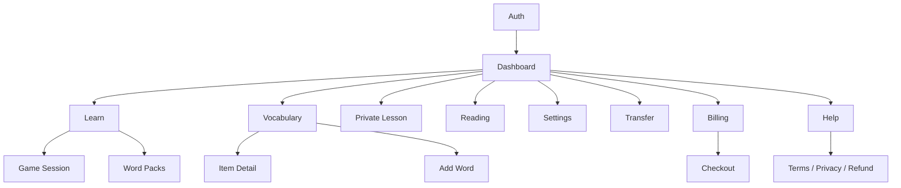

# 17 — קטלוג מסכים ותיאור UX

## 2026-10-06 - Fullscreen game entry follow-up

Web `9cff6a0f1de1c22da04e6d5ed285171d258457fb` follows the Figma correction. Fullscreen game entry stays contained in RTL; regression now samples the mounted game at animation start/middle/end. 84 viewport cases and local check (207 unit / 20 gateway-security), formatting and zero-finding audit passed. **DEV deployment and final full-browser validation are pending; production excluded.** [Canonical source, behavior and release gate](28_UX_2_1_DEV.md#2026-10-06---game-entry-regression-follow-up).

## 2026-10-06 - Figma fidelity correction, DEV Live

Web `e1948281adabe34d2ff6c4e4dc4f949e90c33436`. SCR-02/03/09 and SCR-UX-01: approved home variants/program cards, focus preparation and avatar/message lesson layout. Course maps retain navigation. New labels are localized; actual plans/progress/provider events remain authoritative. **DEV Web is Live at this source; authenticated home/program/preparation UI smoke and three DEV readiness endpoints passed. Active voice appearance is fixture-verified; no real provider call was started.** **CI release gate remains open: 333 browser passes / 60 initial demo-game overflow failures; follow-up correction required.** [Canonical changes and evidence](28_UX_2_1_DEV.md#2026-10-06---figma-fidelity-correction-local-checkpoint).

## 2026-10-06 - DEV screen acceptance

The UX release is Live in DEV at Web `0e88da53f679a142bf040a51b4c428b6652e0a72`. Actual dashboard, SCR-UX-01 Programs/chooser, map/unit words, library, independent games, lesson preparation and SCR-UX-02 History were inspected; writing letter insertion and server feedback passed. No blanket pixel-exact or live-provider acceptance is claimed. [Canonical DEV release and acceptance](28_UX_2_1_DEV.md#dev-web-release-and-authenticated-smoke-2026-10-06).

## 2026-10-05 - UX 2.1 DEV checkpoint

SCR-UX-01 `/courses` is the program selector; new intake remains `/courses?new=1`. SCR-UX-02 `/history` offers bounded history/report access and actual session resume. SCR-UX-03 `/achievements` is user-opened. Existing SCR-02/03/04/09/10 and SCR-PC screens receive shared responsive styles and flow refinements. No decorative task-stage or unsupported microphone-free teacher is enabled. [Canonical coverage, local verification and deployment blocker](28_UX_2_1_DEV.md).

## 2026-10-05 - Email verification and recovery

SCR-01 gains verification, resend countdown, password confirmation and forgot/reset steps, error/retry states and explicit return to login; implemented and locally verified at Web `da913168f85baddc844978412058cf888117e85c`; production pending. [Flow and status](27_EMAIL_AUTH_RECOVERY.md#process-screens-and-compatibility).

## 2026-10-05 - Selected-language practice

SCR-03 / SCR-04: retain the chosen language while loading/failing; unscoped launch waits and offers retry. Resume links carry selected language; validate active cards before rendering/issuing and explain mismatches with localized `game.languageMismatch`. Queues/cards/exercises exclude incompatible source scripts. Retained library counts can exceed the eligible practice subset. [Canonical behavior and production evidence](26_PRACTICE_LANGUAGE_ISOLATION.md).

## 2026-10-05 - SCR-X01 / SCR-X02 free Google results

An authenticated free learner can use the existing Google action to reach preview results through explicit `dictionary`. No extension UI/package change is required. Saving remains subscription-gated and AI retains its paid gate. See UC-02A and [rollout evidence](10_OPERATIONS.md#2026-10-05---free-google-preview-rollout).

## 2026-10-01 — SCR-10 / SCR-PC-00A אווטאר מורה

לשני המורים ארבע צורות פה במעברים רציפים, מצמוץ בדיבור ונשימה עדינה שאינה
מתחילה מחדש בהפסקות. שתיקה סוגרת את הפה; reduced motion מסתיר תנועות פנים.
FR-LESS-006; [מקור, בדיקות וסטטוס פריסה](25_TUTOR_AVATAR_MOTION.md).

## 2026-10-01 - SCR-16 readable bulk-action footer

`gotIt-front@5bb3f95e7bd16c252d5b57f1d8ec537c2217d99c` arranges the English unit preview's Add selected, I already know, Undo known, Close and full-unit practice controls in a responsive grid. The wider modal and minimum-width action columns avoid the narrow, vertical wrapping observed in authenticated production on `e519242`. The list of 50 words remains scrollable and the footer stays visible at 320px/568px, 525px/709px and desktop in local Playwright. Backend behavior is unchanged; production visual check of this layout commit pending.

## 2026-10-01 - SCR-16 Hebrew bulk-known copy correction

The first deployed bulk-known source `4512a93` rendered its four new Hebrew action/feedback strings as question marks. `gotIt-front@e5192422075850a7db6c64134a13565d3c3acf58` restores the intended Hebrew strings for mark-known, undo-known and both success messages, with exact-copy regression coverage. Local check passed; production redeployment and visual smoke pending at this source checkpoint.

## 2026-10-01 - SCR-16 selected-word known actions

`gotIt-front@4512a93c648867af130c973867fdecfb09f96a1e` keeps labeled word checkboxes, select all/clear, selected count and Add selected in the English unit preview. The selected-word removal button is replaced by bulk "I already know" and "Undo known" controls, each enabled only when at least one checked word can change to that state. A successful action reloads known counts and row states, clears the checks and announces success; an API error leaves checks in place. Individual known and full-unit actions remain. The five footer actions fit the modal at 320px, 525px and desktop in the targeted Playwright regression. Locally verified; production smoke pending.

## 2026-10-01 - SCR-16 selected words

The English unit preview now offers a labeled checkbox per word, select all, clear selection, a selected count, and add/remove-selected buttons. Add includes already linked words in the full replacement payload; remove excludes only checked linked words. Actions are disabled without an applicable selection or during a write. Detail and progress refresh after success; API errors use the existing feedback UI. The known-word control and full-unit start remain available. Source `gotIt-front@623202a3e1f5c51b71baf12bd1c78c4a0967860b`; live-flow regression covers partial add, selective removal, clearing the last link and re-adding; Playwright covers 320px, 525px and desktop modal geometry. Backend dependency `d8d930a7dfbeb01f8f951359c67a3b837fcc99f7`. Locally verified; production smoke pending.

## 2026-10-01 — SCR-16 production rollout observation

Render Web `dep-dav8pnk9v7es73fjv47g` is Live at `gotIt-front@5dd490426768c983c8eef368e2f512ea2b9a780c`. Web `/ready`, `/english-learning` and changed CSS/JS assets returned 200. The browser opened at Login, so the 50-word preview was not visually inspected after deployment; local 320px/525px/desktop layout regression passed.


## 2026-10-01 — SCR-16 Hebrew path name and unit preview alignment

`gotIt-front@5dd490426768c983c8eef368e2f512ea2b9a780c` labels the Hebrew navigation item and path heading "לימוד שפה מאפס". The unit preview aligns English, Hebrew and the per-word known control in stable columns; at phone widths up to 420px the word pair and control stack. Fifty entries scroll inside the modal while its close and add/practice actions remain padded and visible at short viewport heights. The row control has a visible border. A component heading regression and 320px/525px/desktop Playwright layout checks passed locally. Production deployment and visual smoke are pending at this source checkpoint.


## 2026-10-01 — SCR-16 preview control readability

`gotIt-front@383482331ca895c1491123643138bd0973fd7395` keeps the one-click per-word known control on one line in the 50-entry preview at 320px and desktop widths. The English/Hebrew pair wraps in the remaining row space. Component and Playwright layout regressions passed locally; production Web deploy and visual smoke pending at this source checkpoint.

## 2026-10-01 — SCR-16 named units and prior knowledge

`gotIt-front@cbc5bac2a374e150c3d1ef31e77041cba27f387e` shows the server-supplied theme name alongside each unit number and level. Each card has a one-click mark/unmark-whole-unit control and a known count; the preview offers per-entry mark/unmark. Known or truly mastered entries count toward path completion, but only mastery comes from scored evidence. Starting a unit sends only unknown entry IDs; a fully known unit is treated as complete. Existing loading, unavailable, error/retry, billing, modal and pack-practice states remain. Hebrew copy was authored and six other non-English locale catalogs have English fallback text. A live-flow regression and 374 responsive Playwright checks passed locally; production smoke pending. See [23_ENGLISH_LEARNING_PATH](23_ENGLISH_LEARNING_PATH.md).


## 2026-10-01 - SCR-00 shell level placement

`gotIt-front@d2d59437d57580ba3e9db5b8cdc933baf798b2db` shows the latest completed lesson assessment only in the top bar, linked to `/private-lesson?view=level`; the duplicate sidebar card is removed. The generic live-account notice is removed from standard screens. Demo labeling and the Free read-only notice remain. This affects desktop sidebar and mobile drawer in RTL/LTR; navigation and account data are unchanged. `test/app-shell.test.tsx` covers the regression, and 374 responsive Playwright checks passed locally.

Render deployment `dep-dav3tlnpn0mc73a0fp90` reports `Deploy succeeded | Live` for the exact source SHA. Production Web `/ready` returned HTTP 200. An authenticated `/dashboard` browser reload showed the English A2-B2 assessment in the top bar, no sidebar assessment card, and no generic live-account notice.

## 2026-10-01 — SCR-16 unit level context

`gotIt-front@66767de` places the translated level name within each `/english-learning` unit card. The level remains identifiable when a learner scrolls beyond its section heading and sees another unit with the same number. This addresses a report that `satellite` appeared in Basic unit 5; production catalog readback places it in Advanced unit 5. No catalog or API data changes. Basic/Advanced card regression and the complete local Web check passed. Render deployment `dep-dav2m90jo6nc73f7uefg` is Live for that SHA; authenticated production smoke showed the labels and opened the Advanced unit 5 preview containing `satellite`.

## 2026-10-01 — SCR-05/06 mixed-direction placement

`gotIt-front@adb2011869d851c3e01dc0dfa247e06084604dbe` keeps the
English expression and Hebrew reading guide in a shared reading group in
SCR-05 and SCR-06. This corrects a live-observed RTL layout where the two
lines were on opposite sides of the row. Local regression checks the group
and direction; production visual recheck is pending.

## 2026-10-01 — SCR-05/06 pronunciation guide

In the live vocabulary list (SCR-05), a saved reading guide appears in smaller
text immediately below the source expression and above its meaning. The item
detail (SCR-06) repeats the guide below the title. The guide is shown only for
`phoneticScheme=transliteration:<learner-language>`; missing guides and
`hebrew_niqqud` data leave the existing layout intact. The text has the
guide language and automatic direction. Source:
`gotIt-front@c585b8860756e739859137d6e391643c321c5282`.
Locally verified by `test/live.test.tsx`; live browser verification is pending.

## תיקון רצף השיעור — 2026-09-30

במסך השיעור הפעיל נוספו מצב „ממשיכים עם המורה…” וכפתור „נמשיך בשיעור”
רק כאשר מוצה תקציב הפניות או נדרש ניסיון ידני. לא נוסף טופס. זמינות הפעולה
מכבדת מיקרופון, דיבור, השמעה וסיום. מפרט התזמון: [22, סעיף 9](22_PERSONAL_COURSES_IMPLEMENTATION.md).

## מסכי קורס חדשים — 2026-09-30

| מסך | נתיב | תוכן/פעולה מרכזית |
|---|---|---|
| SCR-PC-00A | `/courses`, `/courses/:courseId` | בחירת זוג שפות, שאלה אחת, תשובה בכתב/קול ותמלול לעריכה |
| SCR-PC-00B | `/courses/:courseId` | העדפות שמורות, הבחנה בין דיווח להמלצה, תיקון ואישור לבנייה |
| SCR-PC-01 | `/courses/:courseId` | תוכנית מלאה כטיוטה, אישור נפרד, בקשת שינויים ומיקום נוכחי |
| SCR-PC-02 | בתוך SCR-PC-01 | יחידה נפתחת עם שיעורים, דקדוק, מילים, תלות, יעד ודוגמת בית |
| SCR-PC-03 | `/homework/:homeworkId` | משימה אחת, בדיקה, משוב, רמז, דילוג ושמירה להמשך |
| SCR-PC-04 | בסיום SCR-PC-03 | תוצאה קצרה, מוקד חזרה ופתיחת פירוט |

SCR-10 מציג הכנה קצרה לשיעור קורס וסיכום תמציתי עם כפתור בית; שיחה חופשית נשמרת.
מצבי loading/error/empty, הקלטה/תמלול, כשל ספק, שינוי בגרסה, טיוטה ותוכנית פעילה
מפורטים ב־[22](22_PERSONAL_COURSES_IMPLEMENTATION.md). זכאות, RTL/LTR ו־320px נבדקו
בדפדפן עם fixtures; אין טענת נגישות מלאה או בדיקת מכשיר פיזי.

## 1. מטרת המסמך

זהו אפיון מסכים As-Built המבוסס על routes ורכיבי UI קיימים. הוא מתאר מה המשתמש
רואה, מה הוא יכול לבצע, מאין הנתונים מגיעים ומהם מצבי הקצה. התרשימים הם wireframes
לוגיים ולא עיצוב pixel-perfect.

## 2. מפת ניווט



## 3. מעטפת גלובלית — SCR-00 App Shell

```text
┌──────────── Sidebar ────────────┬──────────── Top bar ─────────────┐
│ Logo                            │ Menu / page title / level / user │
│ [+ New word / Upgrade]          ├──────────────────────────────────┤
│ Dashboard                       │ Subscription / mode banner       │
│ Learn                           │                                  │
│ Private lesson                 │          Page content            │
│ Vocabulary / Packs / Reading   │                                  │
│ Transfer / Settings / Billing  │                                  │
│ Tip / Help / Legal      │                                  │
└─────────────────────────────────┴──────────────────────────────────┘
```

| מאפיין | תיאור |
|---|---|
| Actor | משתמש demo/live; admin/user |
| מטרות | ניווט עקבי, סטטוס חשבון, פעולת capture גלובלית |
| נתונים | profile, subscription, latest lesson assessment |
| וריאנטים | desktop sidebar; mobile drawer+scrim; RTL/LTR |
| בקרות | liveOnly routes, entitlement write, profile load error |
| מצבים | demo/live/free/trial/paid/admin; sidebar open/closed |
| Acceptance | controls 44×44 במובייל, no horizontal overflow, focus תקין |

## 4. SCR-01 — Auth

On Web startup after closing and reopening the browser, a valid saved refresh session restores live mode without displaying the login form (`gotIt-front@9fb80b2`). Explicit logout or an invalid/expired session shows this screen. A transient startup request failure may show the signed-out screen with an error while preserving the saved token for retry on reload. Core's default absolute session lifetime remains 30 days. Locally verified and deployed at the exact SHA; production browser restart smoke pending.

Route: כל route לא־משפטי כאשר `mode=signed-out`.

```text
┌──────────────────────────────┐
│ GotIt value proposition      │
│ [ Login | Register ]         │
│ Email                        │
│ Password                     │
│ [Continue]                   │
│ ─── or ───                   │
│ [Google] [Facebook]          │
│ [Try demo] if enabled        │
└──────────────────────────────┘
```

| נושא | אפיון |
|---|---|
| מטרה | יצירת/חידוש זהות וגישה למוצר |
| פעולות | login/register, Google, Facebook, demo |
| Validation | email תקין, password 12–128; provider token bounded |
| הצלחה | tokens נשמרים, identity/profile נטענים, מעבר ל־Dashboard |
| שגיאות | invalid credentials, existing user, disabled, provider config/token, network |
| Email verification / forgot password | Implemented in current task; [release status](27_EMAIL_AUTH_RECOVERY.md) |

Facebook button failure state (`gotIt-front@af299153dde90879aafa0aa3a42e1ae8a8d2469d`): after a user click, the button is busy while the Meta SDK login callback is pending. If no callback arrives within 60 seconds, it becomes available again and displays a localized message instructing the user to close the Facebook window and retry. A late callback from the expired attempt cannot create a Core session. This state is locally verified by `test/facebook.test.tsx` and deployed with a passing public asset smoke; the 60-second production UI state and real Meta login remain unverified.

## 5. SCR-02 — Dashboard

Route: `/dashboard`; רכיבים נפרדים ל־demo ול־live.

```text
┌ Greeting + Start learning ─────────────────────┐
│ Due │ New │ Mastered │ XP/Level │ Streak       │
├ Daily goal ───────────┬ Library snapshot ──────┤
├ Five skills chart ────┴ Your week ─────────────┤
├ Installed packs / Strengthen items ────────────┤
└ Recent practice sessions ──────────────────────┘
```

| נושא | אפיון |
|---|---|
| מטרה | לתת תמונת מצב ו־next best action |
| Data | `/dashboard`, `/dashboard/activity`, `/gamification`, packs |
| פעולות | start smart review, open pack/item/session history |
| States | loading/error/empty/new user/active learner/read-only |
| Rules | live metrics מהשרת בלבד; demo projections מקומיים מסומנים |
| KPI UI | daily goal, due count, skill weakness, weekly time/XP |

## 6. SCR-03 — Learn Hub

Route: `/learn`.

```text
┌ Smart review ───────────────────────────────┐
│ Due/new summary          [Start smart]      │
├ Choose activity ────────────────────────────┤
│ Flashcards │ Recall │ Listening │ Matching  │
│ Pronunciation │ Private lesson │ Packs      │
├ Next words / Queue ─────────────────────────┤
└ Session history ────────────────────────────┘
```

| נושא | אפיון |
|---|---|
| Data | capabilities, learning queue, sessions |
| פעולות | smart session, manual game, selected items/scope |
| Gating | `practice.play`; speech modes לפי capability |
| Empty | אין active words → capture/packs CTA |
| Locked | subscription required → Billing CTA |
| Acceptance | אין התחלת exercise אם session creation נכשל |

## 7. SCR-04 — Practice Session

Route: `/learn/session/:type`.

המסך הוא stateful workflow ולא עמוד סטטי:

```text
Study intro → Exercise → Submit → Feedback → Next → Session summary
```

### 7.1 Study state

```text
┌ Progress / Exit ──────────────────────┐
│ image (optional)                      │
│ source expression                    │
│ primary translation                  │
│ [audio]                         [Next]│
└───────────────────────────────────────┘
```

### 7.2 Exercise state

מוצג לפי type: typed field/letter boxes, multiple choices, draggable matching,
audio+dictation, flashcard self-rating או microphone recording.

### 7.3 Feedback/summary

מציג result, server score, expected/corrected form לפי receipt, XP, mastery change,
next review ו־session totals.

| בקרה | דרישה |
|---|---|
| Answer authority | הלקוח אינו מחשב score ב־live |
| Retry | submit retry משתמש באותו UUID |
| Exit | session active מקבל confirm/abandon semantics |
| Audio | tracks נעצרים ביציאה/כשל |
| Accessibility | keyboard לכל controls; matching alternative |
| Errors | exercise expired/consumed → recover/new exercise, לא local success |

## 8. SCR-05 — Vocabulary Library

Route: `/vocabulary`.

```text
┌ Title / count / Add word ────────────────────┐
│ Search │ status │ language │ tag │ sort      │
│ Bulk selection + action toolbar              │
├──────────────────────────────────────────────┤
│ Source │ Translation │ Status │ Due │ Actions│
│ ... paginated rows/cards ...                 │
└ Pagination / load more ──────────────────────┘
```

| נושא | אפיון |
|---|---|
| Filters | search, source/target, user/learning status, hard, priority, due, practiced, tag, pack |
| Sort | alphabetic, recent, status, weakest/strongest, due, most practiced |
| Actions | edit, practice, pause/resume, archive/delete/restore, mastery, priority, hard, tags |
| Gating | reads ב־free; writes require `vocabulary.write` |
| Empty | מותאם למסנן לעומת ספרייה ריקה |
| Pagination | bounded; cursor/page לא יחד |

## 9. SCR-06 — Learning Item Detail/Edit

נפתח מתוך הספרייה כ־modal/drawer.

תוכן:

- source, primary translation, variants, language pair, type/POS.
- user/learning/retention status, mastery requirements ו־five skills.
- due/last practiced/attempt counts.
- occurrences עם context/URL/time.
- examples, tags ו־translation provenance/history.
- semantic edit fields ו־status actions.

בקרות: `expectedUpdatedAt` ל־optimistic conflict; semantic edit מציג אזהרת reset
של evidence נוכחי; deletion הוא soft; URL חיצוני נפתח באופן בטוח.

## 10. SCR-07 — Add Word / Live Capture Modal

נפתח מכפתור global Add Word.

```text
Input → Preview loading → Candidate selection
→ Existing sense decision → Save → Success
```

שדות: source, source/target languages, translation method, sentence/context.
Preview מציג candidate meanings, variants, POS, explanation, phonetics, examples
ו־existing senses. המשתמש יכול לערוך ולבחור merge/new sense. modal אינו נסגר
אוטומטית בזמן pending mutation; retry שומר event ID.

## 11. SCR-08 — Word Packs

Route: `/word-packs`.

| אזור | תוכן |
|---|---|
| Explorer | topics, tracks, levels, language pair |
| Pack card | title, description, word count, installed/progress |
| Detail | entries עם source/translation/example ו־selection |
| Actions | add selected, practice scope, remove/archive/keep |
| States | no matching profile language, no results, locked write, loading/error |

Acceptance: בחירה אינה מעל 100; entries שלא נבחרו מסומנים excluded; remove מציג
בבירור אם מילים יישמרו או יאורכבו.

## 12. SCR-09 — Reading

Route: `/reading`.

```text
┌ Create reading ──────────────────────────────┐
│ Topic │ Language │ CEFR │ Type │ Length      │
│ Vocabulary: smart or selected               │
│ Quota status                [Generate]       │
├ Preview (not persisted) ─────────────────────┤
│ Title + highlighted target expressions      │
│ [Open / Save] [Discard]                     │
├ Opened reading / Article quiz ───────────────┤
└ History list / detail / delete ──────────────┘
```

מצבים: provider unavailable/auth/billing/rate/timeout, quota exhausted, target
repair warning, loading, preview, opened, history empty. preview token נשאר transient.

## 13. SCR-10 — Private Lesson

Route: `/private-lesson`; המסך כולל כמה subviews.

### 13.1 Setup

- target/support language ו־absolute beginner rule.
- level, duration, teacher voice/speed.
- focus areas/custom focus.
- correction/vocabulary mode.
- roadmap selection והעדפות שמורות.

### 13.2 Live lesson

```text
┌ Topic / connection / timer / mute / finish ─┐
│                 Tutor avatar                 │
│          listening / speaking / thinking     │
│                                             │
│ latest transcript / vocabulary               │
│ [Translate latest] [Finish lesson]           │
└─────────────────────────────────────────────┘
```

### 13.3 Completion report

strengths, corrections, grammar, vocabulary, suggestions, next step, save suggested
words, review now, assessment range/confidence/skills.

### 13.4 History/Level/Roadmap

רשימת lessons, פתיחת report, מחיקה, language filter, current roadmap/milestones
ו־level evidence. מצב report pending/failed מאפשר retry.

## 14. SCR-11 — Settings

Route: `/settings`.

Sections קיימים:

- interface language.
- personal/profile identity display.
- default source and translation languages.
- learning languages + self-assessed CEFR.
- interests.
- daily goal type/value ו־new items/day.
- translation preference.
- enabled learning skills.
- reminders UI section.

ב־live, save שולח profile patch validated. ב־demo נשמר local. אין להציג reminder
delivery כפעיל ללא backend/email/browser implementation מאומת.

## 15. SCR-12 — Transfer

Route: `/transfer`.

| אזור | פעולה |
|---|---|
| Export | איסוף כל העמודים והורדת JSON versioned |
| Import | בחירת file ≤ client limit, parse/validate preview |
| Results | success/failed per event, partial 207, retry failures only |

המסך אינו מייבא attempts/XP. file error ממופה ל־validation/format/size ולא נשלח
לפני parse בסיסי.

## 16. SCR-13 — Billing

Route: `/billing`.

```text
Current plan / tier / trial days / subscription status
Entitlements summary
Selectable plan cards: Pro / AI Tutor subscriptions / one-time minutes pack
[Upgrade] [Manage subscription]
```

מצבים: admin, free, active trial, paid, past_due grace, paused/canceled, billing not
configured, portal/checkout error. אין הצגת provider customer/subscription IDs.
Free מוצגת רק בסיכום התוכנית הנוכחית כשהיא הוקצתה בידי Core; היא אינה כרטיס
לבחירה גם אם היא מופיעה בקטלוג התוכניות.

## 17. SCR-14 — Checkout Handoff

Route: `/billing/checkout` ציבורי לרינדור return/handoff.

מצבים: missing transaction, runtime config unavailable, Paddle loading, ready/open,
completed/canceled/error. client token ו־price IDs מגיעים מ־`/runtime-config`; הם
public identifiers. API key/webhook secret אינם מגיעים למסך.

## 18. SCR-15 — Help ו־Legal

`/help` מסביר meaning/senses, practice, account/privacy ו־feature availability.
Terms, Privacy ו־Refund זמינים בכמה aliases ונגישים ללא session. שינוי משפטי
דורש review; עצם קיום העמוד אינו אישור שהמדיניות מכסה כל rollout חדש.

## 19. Chrome — SCR-X01 Popup

```text
Signed out: Email/Password + Google
Signed in:
  Capture context/manual text
  Languages + compact settings
  Preview candidates/existing senses
  Edit / audio / save decision
  Success + practice invitation
```

ה־popup נע בין small/medium/large, light/dark ו־RTL/LTR. badge מציין pending
capture כאשר Chrome אינו מאפשר לפתוח popup אוטומטית.

## 20. Chrome — SCR-X02 Inline Translation

נפתח ליד selection/double-click בתוך Shadow DOM. מציג source, translation,
candidate meanings, AI action, audio, saved state, quick save/remove ו־practice CTA.
close-on-outside-click ניתן להגדרה. content script אינו מקבל tokens/provider keys.

## 21. Chrome — SCR-X03 Options

כולל onboarding, selection action, double-click, outside close, popup size,
auto-close after save, theme ושפות default. שינוי feature שדורש broad origins
מתאם optional permission/content registration ומציג rationale.

## 22. מטריצת מצבים רוחבית

כל מסך נתונים חייב לתכנן לפחות:

| מצב | התנהגות |
|---|---|
| Initial loading | skeleton/status ללא layout jump חמור |
| Empty | הסבר + CTA אפשרי, לא טבלה ריקה |
| Validation | שדה מסומן + summary נגיש לפי צורך |
| Network | retry בטוח; mutation שומר UUID |
| Unauthorized | refresh אחד ואז sign-in |
| Forbidden/locked | הסבר tier/capability + Billing CTA |
| Provider unavailable | feature-specific; core library נשארת פעילה |
| Partial success | פירוט per item; לא “הכול נכשל” |
| Stale/conflict | reload/preview מחדש; אין overwrite שקט |
| Offline | state נשמר ככל שניתן, בלי success מזויף |

## 23. Definition of Done למסך חדש

1. מזהה SCR, actor, goal ו־entry/exit.
2. wireframe ואנטומיית רכיבים.
3. data/API ownership ו־entitlements.
4. כל מצבי הטבלה לעיל.
5. RTL/LTR, keyboard, focus, labels, announcements.
6. 320px, mobile landscape, tablet ו־desktop.
7. analytics event מינימלי ומאושר אם נדרש.
8. component/route tests ו־acceptance criteria.
9. עדכון App routing, i18n, Help, Current Features ו־Traceability.

## SCR-16 — English learning path

Route: `/english-learning` (live Web). Actor: authenticated learner with an English-source/Hebrew-translation profile. Entry: primary navigation or a link from SCR-08. Goal: work through Basic, Good and Advanced in ordered 50-entry units. The screen shows server-reported mastery, next unfinished unit, a preview of all entries, and actions to install/start or resume pack-scoped smart practice. Exit: smart practice or another navigation destination. Data owner: existing GotIt word-pack APIs; entitlement: `vocabulary.write` to install, practice entitlement checked by the session route. States: loading, error/retry, no compatible catalog, preview, installing, billing restriction, installed, partial, mastered. Modal focus follows the shared modal component. Layout uses responsive unit grids and supports RTL/LTR and 320px. Acceptance: no 1,000-entry bulk installation; 50 IDs are submitted for one unit; existing SCR-08 excludes course units and links here. Source: `gotIt-front@4da34116f8b5c6242d5e7ace61f63493ebf185af`. Production smoke pending.
