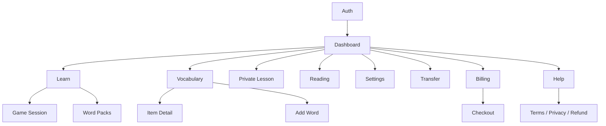

# 17 — קטלוג מסכים ותיאור UX

## 2026-10-01 — SCR-05/06 mixed-direction placement

`gotIt-front@adb2011869d851c3e01dc0dfa247e06084604dbe` keeps the
English expression and Hebrew reading guide in a shared reading group in
SCR-05 and SCR-06. This corrects a live-observed RTL layout where the two
lines were on opposite sides of the row. Local regression checks the group
and direction; production visual recheck is pending.

## 2026-10-01 — SCR-05/06 pronunciation guide

In the live vocabulary list (SCR-05), a saved reading guide appears in smaller
text immediately below the source expression and above its meaning. The item
detail (SCR-06) repeats the guide below the title. The guide is shown only for
`phoneticScheme=transliteration:<learner-language>`; missing guides and
`hebrew_niqqud` data leave the existing layout intact. The text has the
guide language and automatic direction. Source:
`gotIt-front@c585b8860756e739859137d6e391643c321c5282`.
Locally verified by `test/live.test.tsx`; live browser verification is pending.

## תיקון רצף השיעור — 2026-09-30

במסך השיעור הפעיל נוספו מצב „ממשיכים עם המורה…” וכפתור „נמשיך בשיעור”
רק כאשר מוצה תקציב הפניות או נדרש ניסיון ידני. לא נוסף טופס. זמינות הפעולה
מכבדת מיקרופון, דיבור, השמעה וסיום. מפרט התזמון: [22, סעיף 9](22_PERSONAL_COURSES_IMPLEMENTATION.md).

## מסכי קורס חדשים — 2026-09-30

| מסך | נתיב | תוכן/פעולה מרכזית |
|---|---|---|
| SCR-PC-00A | `/courses`, `/courses/:courseId` | בחירת זוג שפות, שאלה אחת, תשובה בכתב/קול ותמלול לעריכה |
| SCR-PC-00B | `/courses/:courseId` | העדפות שמורות, הבחנה בין דיווח להמלצה, תיקון ואישור לבנייה |
| SCR-PC-01 | `/courses/:courseId` | תוכנית מלאה כטיוטה, אישור נפרד, בקשת שינויים ומיקום נוכחי |
| SCR-PC-02 | בתוך SCR-PC-01 | יחידה נפתחת עם שיעורים, דקדוק, מילים, תלות, יעד ודוגמת בית |
| SCR-PC-03 | `/homework/:homeworkId` | משימה אחת, בדיקה, משוב, רמז, דילוג ושמירה להמשך |
| SCR-PC-04 | בסיום SCR-PC-03 | תוצאה קצרה, מוקד חזרה ופתיחת פירוט |

SCR-10 מציג הכנה קצרה לשיעור קורס וסיכום תמציתי עם כפתור בית; שיחה חופשית נשמרת.
מצבי loading/error/empty, הקלטה/תמלול, כשל ספק, שינוי בגרסה, טיוטה ותוכנית פעילה
מפורטים ב־[22](22_PERSONAL_COURSES_IMPLEMENTATION.md). זכאות, RTL/LTR ו־320px נבדקו
בדפדפן עם fixtures; אין טענת נגישות מלאה או בדיקת מכשיר פיזי.

## 1. מטרת המסמך

זהו אפיון מסכים As-Built המבוסס על routes ורכיבי UI קיימים. הוא מתאר מה המשתמש
רואה, מה הוא יכול לבצע, מאין הנתונים מגיעים ומהם מצבי הקצה. התרשימים הם wireframes
לוגיים ולא עיצוב pixel-perfect.

## 2. מפת ניווט



## 3. מעטפת גלובלית — SCR-00 App Shell

```text
┌──────────── Sidebar ────────────┬──────────── Top bar ─────────────┐
│ Logo                            │ Menu / page title / level / user │
│ [+ New word / Upgrade]          ├──────────────────────────────────┤
│ Dashboard                       │ Subscription / mode banner       │
│ Learn                           │                                  │
│ Private lesson                 │          Page content            │
│ Vocabulary / Packs / Reading   │                                  │
│ Transfer / Settings / Billing  │                                  │
│ Level card / Help / Legal      │                                  │
└─────────────────────────────────┴──────────────────────────────────┘
```

| מאפיין | תיאור |
|---|---|
| Actor | משתמש demo/live; admin/user |
| מטרות | ניווט עקבי, סטטוס חשבון, פעולת capture גלובלית |
| נתונים | profile, subscription, latest lesson assessment |
| וריאנטים | desktop sidebar; mobile drawer+scrim; RTL/LTR |
| בקרות | liveOnly routes, entitlement write, profile load error |
| מצבים | demo/live/free/trial/paid/admin; sidebar open/closed |
| Acceptance | controls 44×44 במובייל, no horizontal overflow, focus תקין |

## 4. SCR-01 — Auth

Route: כל route לא־משפטי כאשר `mode=signed-out`.

```text
┌──────────────────────────────┐
│ GotIt value proposition      │
│ [ Login | Register ]         │
│ Email                        │
│ Password                     │
│ [Continue]                   │
│ ─── or ───                   │
│ [Google] [Facebook]          │
│ [Try demo] if enabled        │
└──────────────────────────────┘
```

| נושא | אפיון |
|---|---|
| מטרה | יצירת/חידוש זהות וגישה למוצר |
| פעולות | login/register, Google, Facebook, demo |
| Validation | email תקין, password 12–128; provider token bounded |
| הצלחה | tokens נשמרים, identity/profile נטענים, מעבר ל־Dashboard |
| שגיאות | invalid credentials, existing user, disabled, provider config/token, network |
| חסר נוכחי | forgot password, email verification |

## 5. SCR-02 — Dashboard

Route: `/dashboard`; רכיבים נפרדים ל־demo ול־live.

```text
┌ Greeting + Start learning ─────────────────────┐
│ Due │ New │ Mastered │ XP/Level │ Streak       │
├ Daily goal ───────────┬ Library snapshot ──────┤
├ Five skills chart ────┴ Your week ─────────────┤
├ Installed packs / Strengthen items ────────────┤
└ Recent practice sessions ──────────────────────┘
```

| נושא | אפיון |
|---|---|
| מטרה | לתת תמונת מצב ו־next best action |
| Data | `/dashboard`, `/dashboard/activity`, `/gamification`, packs |
| פעולות | start smart review, open pack/item/session history |
| States | loading/error/empty/new user/active learner/read-only |
| Rules | live metrics מהשרת בלבד; demo projections מקומיים מסומנים |
| KPI UI | daily goal, due count, skill weakness, weekly time/XP |

## 6. SCR-03 — Learn Hub

Route: `/learn`.

```text
┌ Smart review ───────────────────────────────┐
│ Due/new summary          [Start smart]      │
├ Choose activity ────────────────────────────┤
│ Flashcards │ Recall │ Listening │ Matching  │
│ Pronunciation │ Private lesson │ Packs      │
├ Next words / Queue ─────────────────────────┤
└ Session history ────────────────────────────┘
```

| נושא | אפיון |
|---|---|
| Data | capabilities, learning queue, sessions |
| פעולות | smart session, manual game, selected items/scope |
| Gating | `practice.play`; speech modes לפי capability |
| Empty | אין active words → capture/packs CTA |
| Locked | subscription required → Billing CTA |
| Acceptance | אין התחלת exercise אם session creation נכשל |

## 7. SCR-04 — Practice Session

Route: `/learn/session/:type`.

המסך הוא stateful workflow ולא עמוד סטטי:

```text
Study intro → Exercise → Submit → Feedback → Next → Session summary
```

### 7.1 Study state

```text
┌ Progress / Exit ──────────────────────┐
│ image (optional)                      │
│ source expression                    │
│ primary translation                  │
│ [audio]                         [Next]│
└───────────────────────────────────────┘
```

### 7.2 Exercise state

מוצג לפי type: typed field/letter boxes, multiple choices, draggable matching,
audio+dictation, flashcard self-rating או microphone recording.

### 7.3 Feedback/summary

מציג result, server score, expected/corrected form לפי receipt, XP, mastery change,
next review ו־session totals.

| בקרה | דרישה |
|---|---|
| Answer authority | הלקוח אינו מחשב score ב־live |
| Retry | submit retry משתמש באותו UUID |
| Exit | session active מקבל confirm/abandon semantics |
| Audio | tracks נעצרים ביציאה/כשל |
| Accessibility | keyboard לכל controls; matching alternative |
| Errors | exercise expired/consumed → recover/new exercise, לא local success |

## 8. SCR-05 — Vocabulary Library

Route: `/vocabulary`.

```text
┌ Title / count / Add word ────────────────────┐
│ Search │ status │ language │ tag │ sort      │
│ Bulk selection + action toolbar              │
├──────────────────────────────────────────────┤
│ Source │ Translation │ Status │ Due │ Actions│
│ ... paginated rows/cards ...                 │
└ Pagination / load more ──────────────────────┘
```

| נושא | אפיון |
|---|---|
| Filters | search, source/target, user/learning status, hard, priority, due, practiced, tag, pack |
| Sort | alphabetic, recent, status, weakest/strongest, due, most practiced |
| Actions | edit, practice, pause/resume, archive/delete/restore, mastery, priority, hard, tags |
| Gating | reads ב־free; writes require `vocabulary.write` |
| Empty | מותאם למסנן לעומת ספרייה ריקה |
| Pagination | bounded; cursor/page לא יחד |

## 9. SCR-06 — Learning Item Detail/Edit

נפתח מתוך הספרייה כ־modal/drawer.

תוכן:

- source, primary translation, variants, language pair, type/POS.
- user/learning/retention status, mastery requirements ו־five skills.
- due/last practiced/attempt counts.
- occurrences עם context/URL/time.
- examples, tags ו־translation provenance/history.
- semantic edit fields ו־status actions.

בקרות: `expectedUpdatedAt` ל־optimistic conflict; semantic edit מציג אזהרת reset
של evidence נוכחי; deletion הוא soft; URL חיצוני נפתח באופן בטוח.

## 10. SCR-07 — Add Word / Live Capture Modal

נפתח מכפתור global Add Word.

```text
Input → Preview loading → Candidate selection
→ Existing sense decision → Save → Success
```

שדות: source, source/target languages, translation method, sentence/context.
Preview מציג candidate meanings, variants, POS, explanation, phonetics, examples
ו־existing senses. המשתמש יכול לערוך ולבחור merge/new sense. modal אינו נסגר
אוטומטית בזמן pending mutation; retry שומר event ID.

## 11. SCR-08 — Word Packs

Route: `/word-packs`.

| אזור | תוכן |
|---|---|
| Explorer | topics, tracks, levels, language pair |
| Pack card | title, description, word count, installed/progress |
| Detail | entries עם source/translation/example ו־selection |
| Actions | add selected, practice scope, remove/archive/keep |
| States | no matching profile language, no results, locked write, loading/error |

Acceptance: בחירה אינה מעל 100; entries שלא נבחרו מסומנים excluded; remove מציג
בבירור אם מילים יישמרו או יאורכבו.

## 12. SCR-09 — Reading

Route: `/reading`.

```text
┌ Create reading ──────────────────────────────┐
│ Topic │ Language │ CEFR │ Type │ Length      │
│ Vocabulary: smart or selected               │
│ Quota status                [Generate]       │
├ Preview (not persisted) ─────────────────────┤
│ Title + highlighted target expressions      │
│ [Open / Save] [Discard]                     │
├ Opened reading / Article quiz ───────────────┤
└ History list / detail / delete ──────────────┘
```

מצבים: provider unavailable/auth/billing/rate/timeout, quota exhausted, target
repair warning, loading, preview, opened, history empty. preview token נשאר transient.

## 13. SCR-10 — Private Lesson

Route: `/private-lesson`; המסך כולל כמה subviews.

### 13.1 Setup

- target/support language ו־absolute beginner rule.
- level, duration, teacher voice/speed.
- focus areas/custom focus.
- correction/vocabulary mode.
- roadmap selection והעדפות שמורות.

### 13.2 Live lesson

```text
┌ Topic / connection / timer / mute / finish ─┐
│                 Tutor avatar                 │
│          listening / speaking / thinking     │
│                                             │
│ latest transcript / vocabulary               │
│ [Translate latest] [Finish lesson]           │
└─────────────────────────────────────────────┘
```

### 13.3 Completion report

strengths, corrections, grammar, vocabulary, suggestions, next step, save suggested
words, review now, assessment range/confidence/skills.

### 13.4 History/Level/Roadmap

רשימת lessons, פתיחת report, מחיקה, language filter, current roadmap/milestones
ו־level evidence. מצב report pending/failed מאפשר retry.

## 14. SCR-11 — Settings

Route: `/settings`.

Sections קיימים:

- interface language.
- personal/profile identity display.
- default source and translation languages.
- learning languages + self-assessed CEFR.
- interests.
- daily goal type/value ו־new items/day.
- translation preference.
- enabled learning skills.
- reminders UI section.

ב־live, save שולח profile patch validated. ב־demo נשמר local. אין להציג reminder
delivery כפעיל ללא backend/email/browser implementation מאומת.

## 15. SCR-12 — Transfer

Route: `/transfer`.

| אזור | פעולה |
|---|---|
| Export | איסוף כל העמודים והורדת JSON versioned |
| Import | בחירת file ≤ client limit, parse/validate preview |
| Results | success/failed per event, partial 207, retry failures only |

המסך אינו מייבא attempts/XP. file error ממופה ל־validation/format/size ולא נשלח
לפני parse בסיסי.

## 16. SCR-13 — Billing

Route: `/billing`.

```text
Current plan / tier / trial days / subscription status
Entitlements summary
Plan cards: Free / Pro monthly / Pro yearly
[Upgrade] [Manage subscription]
```

מצבים: admin, free, active trial, paid, past_due grace, paused/canceled, billing not
configured, portal/checkout error. אין הצגת provider customer/subscription IDs.

## 17. SCR-14 — Checkout Handoff

Route: `/billing/checkout` ציבורי לרינדור return/handoff.

מצבים: missing transaction, runtime config unavailable, Paddle loading, ready/open,
completed/canceled/error. client token ו־price IDs מגיעים מ־`/runtime-config`; הם
public identifiers. API key/webhook secret אינם מגיעים למסך.

## 18. SCR-15 — Help ו־Legal

`/help` מסביר meaning/senses, practice, account/privacy ו־feature availability.
Terms, Privacy ו־Refund זמינים בכמה aliases ונגישים ללא session. שינוי משפטי
דורש review; עצם קיום העמוד אינו אישור שהמדיניות מכסה כל rollout חדש.

## 19. Chrome — SCR-X01 Popup

```text
Signed out: Email/Password + Google
Signed in:
  Capture context/manual text
  Languages + compact settings
  Preview candidates/existing senses
  Edit / audio / save decision
  Success + practice invitation
```

ה־popup נע בין small/medium/large, light/dark ו־RTL/LTR. badge מציין pending
capture כאשר Chrome אינו מאפשר לפתוח popup אוטומטית.

## 20. Chrome — SCR-X02 Inline Translation

נפתח ליד selection/double-click בתוך Shadow DOM. מציג source, translation,
candidate meanings, AI action, audio, saved state, quick save/remove ו־practice CTA.
close-on-outside-click ניתן להגדרה. content script אינו מקבל tokens/provider keys.

## 21. Chrome — SCR-X03 Options

כולל onboarding, selection action, double-click, outside close, popup size,
auto-close after save, theme ושפות default. שינוי feature שדורש broad origins
מתאם optional permission/content registration ומציג rationale.

## 22. מטריצת מצבים רוחבית

כל מסך נתונים חייב לתכנן לפחות:

| מצב | התנהגות |
|---|---|
| Initial loading | skeleton/status ללא layout jump חמור |
| Empty | הסבר + CTA אפשרי, לא טבלה ריקה |
| Validation | שדה מסומן + summary נגיש לפי צורך |
| Network | retry בטוח; mutation שומר UUID |
| Unauthorized | refresh אחד ואז sign-in |
| Forbidden/locked | הסבר tier/capability + Billing CTA |
| Provider unavailable | feature-specific; core library נשארת פעילה |
| Partial success | פירוט per item; לא “הכול נכשל” |
| Stale/conflict | reload/preview מחדש; אין overwrite שקט |
| Offline | state נשמר ככל שניתן, בלי success מזויף |

## 23. Definition of Done למסך חדש

1. מזהה SCR, actor, goal ו־entry/exit.
2. wireframe ואנטומיית רכיבים.
3. data/API ownership ו־entitlements.
4. כל מצבי הטבלה לעיל.
5. RTL/LTR, keyboard, focus, labels, announcements.
6. 320px, mobile landscape, tablet ו־desktop.
7. analytics event מינימלי ומאושר אם נדרש.
8. component/route tests ו־acceptance criteria.
9. עדכון App routing, i18n, Help, Current Features ו־Traceability.
